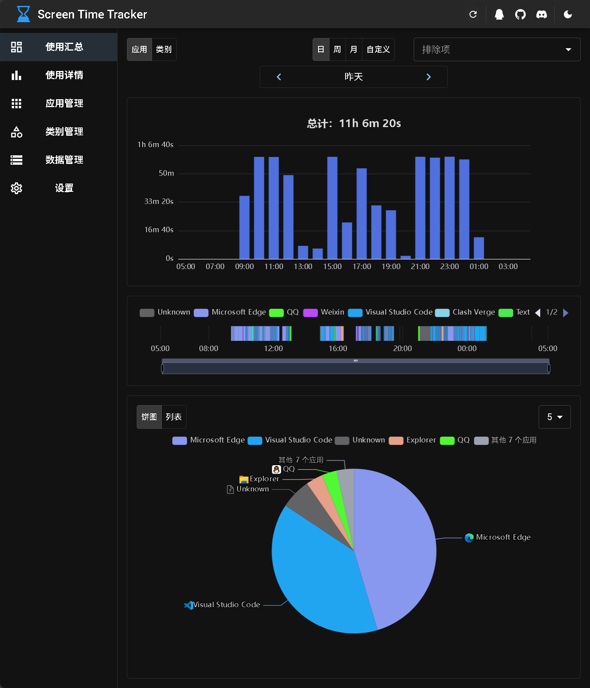
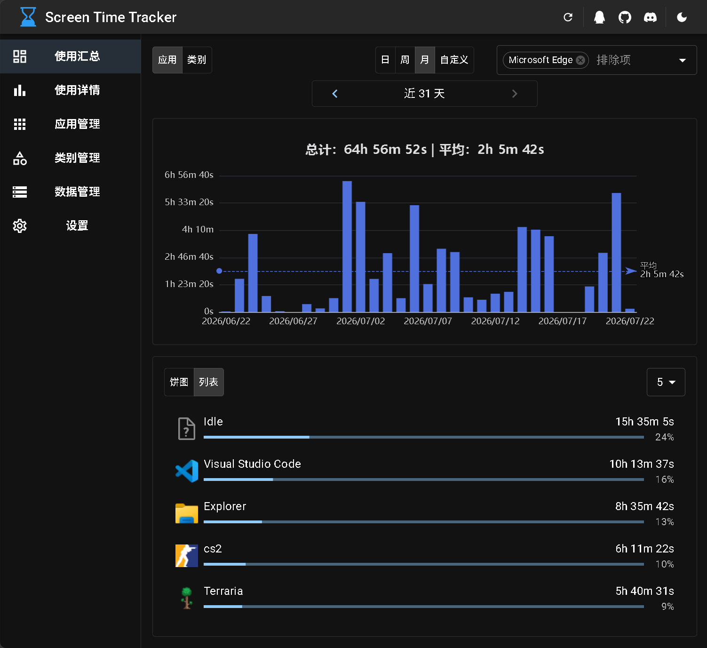

<div align="center">

# Screen Time Tracker

[English](README.md) | **简体中文**

[](https://discord.gg/PxqGwcsVuh) [](https://qm.qq.com/q/uiwJZiQRAm)

</div>

## 简介
一款直观、轻量级的桌面端屏幕使用时间统计工具，助你掌握电脑使用习惯、提升工作效率，保持健康的工作与生活平衡。




## 核心功能
- **时长统计**：后台静默运行，精准记录各个软件的使用时长。
- **可视化数据分析**：提供种类丰富且直观的时长统计图表，清晰掌握时间分配。
- **注重隐私安全**：所有数据均存储在本地，不上传云端，保障个人隐私。
-  **轻量高效**：极低占用内存与 CPU，不影响日常使用体验。
-  **高度可配置**：提供了详细的配置选项，满足不同用户的需求。
- **多语言支持**：原生支持中文与英文界面。

## 下载
您可以通过 [Releases](https://github.com/majianchuan/ScreenTimeTracker/releases) 下载软件或自行构建。

## 开发
- 准备环境
  - .NET SDK 10.0+
  - Node.js 22.12.0+
- 克隆代码库：
  ```shell
    git clone https://github.com/majianchuan/ScreenTimeTracker.git
  ```
- 构建前端界面：
  ```shell
  cd src/frontend
  pnpm install
  pnpm build
  ```
- 启动应用：
  ```shell
  cd ../Hosts/Desktop
  dotnet run
  ```

## 交流与反馈

如果你在使用过程中遇到问题，或者有任何好的建议，欢迎加入我们的社群交流：

- **Discord 社区**：[点击加入 Discord](https://discord.com/invite/PxqGwcsVuh)
- **QQ 交流群**：[点击加入 QQ 群聊](https://qm.qq.com/q/uiwJZiQRAm)

