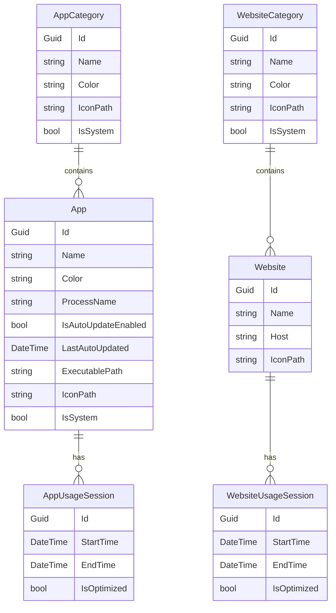

```mermaid
erDiagram
    AppCategory ||--o{ App : contains
    App ||--o{ AppUsageSession : has
    WebsiteCategory ||--o{ Website : contains
    Website ||--o{ WebsiteUsageSession : has


    App {
        Guid Id
        string Name
        string Color
        string ProcessName
        bool IsAutoUpdateEnabled
        DateTime LastAutoUpdated
        string ExecutablePath
        string IconPath
        bool IsSystem
    }

    AppCategory {
        Guid Id
        string Name
        string Color
        string IconPath
        bool IsSystem
    }

    AppUsageSession {
        Guid Id
        DateTime StartTime
        DateTime EndTime
        bool IsOptimized
    }

    Website {
        Guid Id
        string Name
        string Host
        string IconPath
    }

    WebsiteCategory {
        Guid Id
        string Name
        string Color
        string IconPath
        bool IsSystem
    }

    WebsiteUsageSession {
        Guid Id
        DateTime StartTime
        DateTime EndTime
        bool IsOptimized
    }
```